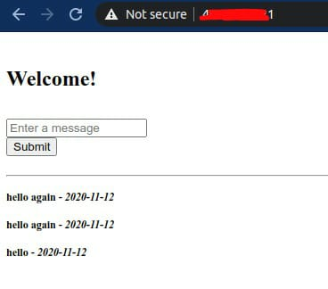

## Dockerizing Flask With Compose and Machine - From Localhost to the Cloud (Azure)


### Local setup:
- [Docker](https://docs.docker.com/get-docker/)
- [Docker Compose](https://docs.docker.com/compose/install/)
- [Docker Machine](https://docs.docker.com/machine/install-machine/)

### Test out the installs:
```
docker --version
docker-machine --version
docker-compose --version
```
### Deployment to the Localhost

**Check out the awesome blog post here > https://realpython.com/blog/python/dockerizing-flask-with-compose-and-machine-from-localhost-to-the-cloud/**

First clone the project from the repository or create your own project based on the project structure found on the repo:
```
.
├── docker-compose.yml
├── flask-app.jpeg
├── nginx
│   ├── Dockerfile
│   └── sites-enabled
│       └── flask_project
├── README.md
└── web
    ├── app.py
    ├── config.py
    ├── create_db.py
    ├── Dockerfile
    ├── models.py
    ├── requirements.txt
    ├── static
    │   ├── css
    │   │   ├── bootstrap.min.css
    │   │   └── main.css
    │   ├── img
    │   └── js
    │       ├── bootstrap.min.js
    │       └── main.js
    └── templates
        ├── _base.html
        └── index.html
```

We’re now ready to get the containers up and running. Enter Docker Machine.
To start Docker Machine, first make sure you’re in the project root and then simply follow the steps below.

### Deployment to the Cloud (Azure)

1. Create new Docker Machine called `production` and deploy it to Azure.
    ```
    docker-machine create --driver azure \
        --azure-subscription-id <your-azure-subscription-id> \
        --azure-size Standard_B1s 
        --azure-open-port 80 \
        production
    ```

2. Then set `production` as the active machine and load the Docker environment into the shell:
    ```
    eval "$(docker-machine env production)"
    ```

3. Finally, let’s build the Flask app in the cloud:
    ```
    docker-compose up --build -d
    docker-compose run web /usr/local/bin/python create_db.py
    ```

4. Grab the IP address associated with VM from Azure portal or `docker-machine ip production` and view it in the browser. If all went well, you should see your app running.

    

### Other References:

* <https://docs.microsoft.com/en-us/azure/virtual-machines/linux/docker-machine>
* <https://docs.docker.com/machine/drivers/azure/>